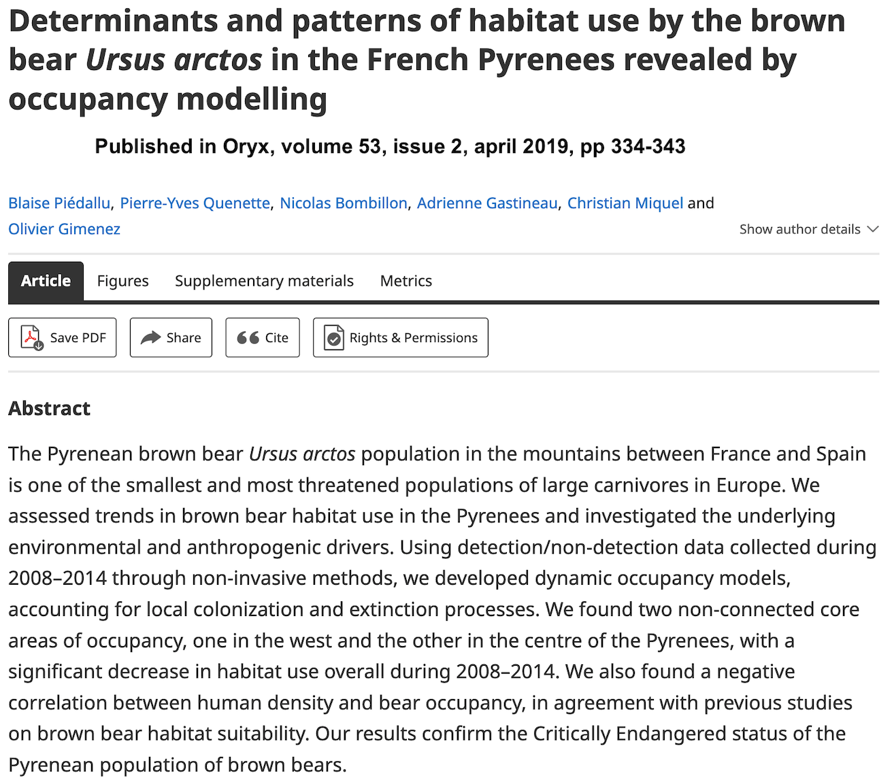

```{r setup, include=FALSE}
knitr::opts_chunk$set(fig.align = "center", 
                      message = FALSE, 
                      warning = FALSE, 
                      paged.print = FALSE)
```


# Simple Features for R: the sf package

```{r echo = FALSE, out.width = "700px"}
knitr::include_graphics("img/sfcartoon.jpg")
```

---
class: inverse, middle, center
# Introduction
---


# What's so nice about `sf`?

* Easy to work with spatial data because the distinction between spatial data and other forms of data is minimized

* Spatial objects are stored as **dataframes**, with the feature geometries stored in list-columns

* This is similar to the way that **spatial databases** are structured

* All functions begin with `st_` for easy autofill with RStudio tab 

* Functions are **pipe-friendly**

* `dplyr` and `tidyr` verbs have been defined for the `sf` objects

* `ggplot2` is able to plot `sf` objects directly

```{r echo=FALSE, out.width = "100px"}
knitr::include_graphics("img/animatedsf.gif")
```


---

# Load packages

```{r message=TRUE, warning=FALSE, paged.print=FALSE}
library(sf) # GIS package
library(tidyverse) # tidyverse packages, dplyr and ggplot2 among others
theme_set(theme_minimal()) # set ggplot theme 
```


---

## Vector layers in `sf`

* The `sf` class is a hierarchical structure composed of 3 classes 
    * In green, **sf** - Vector layer object, `data.frame` with $\geq 1$ attribute columns and 1 geometry column
    * In red, **sfc** - Geometric part of vector layer - geometry column
    * In blue, **sfg** - Geometry of individual [simple feature](https://en.wikipedia.org/wiki/Simple_Features)

```{r, echo=FALSE}
knitr::include_graphics("img/sf_xfig.png")
```


---

## Simple feature geometry **`sfg`**

```{r echo=FALSE, dpi = 300, out.width = "550px", fig.align='center',warning=FALSE}
# knitr::include_graphics("images/simple_feature_types.png")
point <- st_as_sfc("POINT (30 10)")[[1]]
linestring <- st_as_sfc("LINESTRING (30 10, 10 30, 40 40)")[[1]]
polygon <- st_as_sfc("POLYGON ((35 10, 45 45, 15 40, 10 20, 35 10),(20 30, 35 35, 30 20, 20 30))")[[1]]
multipoint <- st_as_sfc("MULTIPOINT ((10 40), (40 30), (20 20), (30 10))")[[1]]
multilinestring <- st_as_sfc("MULTILINESTRING ((10 10, 20 20, 10 40),(40 40, 30 30, 40 20, 30 10))")[[1]]
multipolygon <- st_as_sfc("MULTIPOLYGON (((40 40, 20 45, 45 30, 40 40)),((20 35, 10 30, 10 10, 30 5, 45 20, 20 35),(30 20, 20 15, 20 25, 30 20)))")[[1]]
geometrycollection <- st_as_sfc("GEOMETRYCOLLECTION (POLYGON((30 20, 45 40, 10 40, 30 20)),LINESTRING (10 10, 20 20, 10 30),POINT (40 20))")[[1]]
pol <- st_as_sfc("POLYGON((30 20, 45 40, 10 40, 30 20))")[[1]]
l <- st_as_sfc("LINESTRING (10 10, 20 20, 10 30)")[[1]]
p <- st_as_sfc("POINT (40 20)")[[1]]
opar <- par()
par(mfrow = c(2, 4), mar = c(1,1,1,1))
plot(point, main = "POINT", col = "blue", cex = 1.8, lwd = 2)
plot(linestring, main = "LINESTRING", col = "blue", lwd = 2)
plot(polygon, main = "POLYGON", border = "blue", col = "#0000FF33", lwd = 2)
plot(1, type="n", axes=F, xlab="", ylab="")
plot(multipoint, main = "MULTIPOINT", col = "blue", cex = 1.8, lwd = 2)
plot(multilinestring, main = "MULTILINESTRING", col = "blue", lwd = 2)
plot(multipolygon, main = "MULTIPOLYGON", border = "blue", col = "#0000FF33", lwd = 2)
plot(geometrycollection, main = "GEOMETRYCOLLECTION", col = NA, border = NA, lwd = 2)
plot(pol, border = "blue", col = "#0000FF33", add = TRUE, lwd = 2)
plot(l, col = "blue", add = TRUE, lwd = 2)
plot(p, col = "blue", add = TRUE, cex = 1.8, lwd = 2)
par(opar)
```


---
class: inverse, middle, center
# First steps
---


# Case study

```{r echo=FALSE, message=FALSE, warning=FALSE, paged.print=FALSE, out.width = "800px", fig.align = "center"}

```

---

# Read in spatial data

```{r message=FALSE, warning=FALSE, paged.print=FALSE}
studysites_raw <- st_read("shp/bearpyrenees.shp")
```

---

# Examine structure

```{r message=FALSE, warning=FALSE, paged.print=FALSE}
glimpse(studysites_raw)
```

---

# Examine structure

```{r message=FALSE, warning=FALSE, paged.print=FALSE}
studysites_raw
```


---

# Select relevant columns

```{r message=FALSE, warning=FALSE, paged.print=FALSE}
studysites <- studysites_raw %>%
  select('bearpresence' = pres_08_12, #<<
         'idsite' = Numero) #<<
studysites
```

---

# Our first map

```{r message = FALSE, warning = FALSE, paged.print = FALSE, fig.align = 'center',fig.dim = c(15, 7), dpi = 300}
studysites %>%
  ggplot() + #<<
  geom_sf() + #<<
  labs(title = 'Brown bear monitoring sites in the French Pyrenees mountains',
       subtitle = 'Source: French Game and Wildlife Agency')
```

---

# Where did the species occur?

```{r message = FALSE, warning = FALSE, paged.print = FALSE, fig.align = 'center',fig.dim = c(15, 7), dpi = 300}
studysites %>%
  ggplot() +
  geom_sf(aes(fill = bearpresence)) + #<<
  labs(title = 'Brown bear presence in the French Pyrenees mountains',
       subtitle = 'Source: French Game and Wildlife Agency')
```

---

# Where did the species occur?

```{r message = FALSE, warning = FALSE, paged.print = FALSE, fig.align = 'center',fig.dim = c(15, 7), dpi = 300}
studysites %>%
  ggplot() +
  geom_sf(aes(fill = bearpresence)) + 
  labs(title = 'Brown bear presence in the French Pyrenees mountains',
       subtitle = 'Source: French Game and Wildlife Agency',
       fill = "Presence") #<<
```


---

# Take control of your legends

```{r message = FALSE, warning = FALSE, paged.print = FALSE, fig.align = 'center',fig.dim = c(15, 7), dpi = 300}
studysites %>%
  ggplot() +
  geom_sf(aes(fill = bearpresence)) +
  labs(title = 'Brown bear presence in the French Pyrenees mountains',
       subtitle = 'Source: French Game and Wildlife Agency') +
  scale_fill_manual(values = c('gray90','steelblue1','steelblue4'), #<<
                    name = "Bear presence", #<<
                    labels = c("Absent", "Occasional", "Regular")) #<<
```

---
class: inverse, middle, center
# Spatial operations: transform, crop, intersect, join
---

# Forest cover

* Forest cover might be a driver of brown bear distribution

* We use corine land cover (CLC) data (2012 version) to get forest cover

* Data can be downloaded [from the official website](http://www.statistiques.developpement-durable.gouv.fr/donnees-ligne/li/2539.html)

* An explanation of what's in the data is available [here](http://www.statistiques.developpement-durable.gouv.fr/donnees-ligne/t/nomenclature-standard.html?tx_ttnews[tt_news]=24270&cHash=2c5863bd046f51082f76794ba2355880).  

---

# Read in data

```{r message=FALSE, warning=FALSE, paged.print=FALSE}
clc2012 <- st_read("shp/CLC12_FR_RGF.shp")
```

---

# Read in data

```{r message=FALSE, warning=FALSE, paged.print=FALSE}
clc2012
```

---

# Extract forest codes
```{r message=FALSE, warning=FALSE, paged.print=FALSE}
forest <- clc2012 %>%
  filter(CODE_12 == 311 | CODE_12 == 312 | CODE_12 == 313) #<<
forest
```

---

# Use same coordinates system for map of the Pyrénées and forest layer
```{r message=FALSE, warning=FALSE, paged.print=FALSE}
studysites <- studysites %>% 
  st_transform(crs = st_crs(forest))  #<<
studysites
```

---

# Calculate area of each site
```{r message=FALSE, warning=FALSE, paged.print=FALSE}
studysites %>% 
  mutate(area = st_area(.), #<<
         .before = 1)
```

---

# Convert area in km<sup>2</sup>
```{r message=FALSE, warning=FALSE, paged.print=FALSE}
studysites %>% 
  mutate(.before = 1,
         area = st_area(.),
         areakm2 = units::set_units(area, km^2)) #<<
```

---

# Define big sites (area > 300 km<sup>2</sup>)
```{r message=FALSE, warning=FALSE, paged.print=FALSE}
studysites <- studysites %>% 
  mutate(.before = 1,
         area = st_area(.),
         areakm2 = units::set_units(area, km^2),
         bigsites = ifelse(as.numeric(areakm2) > 300, areakm2, NA)) #<<
studysites
```

```{r}
# st_is_valid(studysites)
studysites <- st_make_valid(studysites) %>% st_cast()
```

---

# Sort by big sites
```{r message=FALSE, warning=FALSE, paged.print=FALSE}
studysites %>% DT::datatable() #<<
```


---

# Map again, with area on top of big sites
```{r message = FALSE, warning = FALSE, paged.print = FALSE, fig.align = 'center',fig.dim = c(15, 7), dpi = 300}
studysites %>%
  ggplot() + 
  geom_sf() +
  geom_sf_label(aes(label = round(bigsites))) + #<<
  labs(title = 'Brown bear big monitoring sites in the French Pyrenees mountains',
       subtitle = 'Big sites have area > 300km2',
       caption = 'Data from: French Game and Wildlife Agency',
       x = "", y = "")
```

---

# Crop forest to match study area boundaries
```{r message=FALSE, warning=FALSE, paged.print=FALSE}
forest %>% 
  st_crop(st_bbox(studysites)) %>% #<<
  as_tibble()
```

---

# Then intersect the two layers
```{r message=FALSE, warning=FALSE, paged.print=FALSE}
forest %>% 
  st_crop(st_bbox(studysites)) %>%
  st_intersection(studysites) %>% #<<
  as_tibble()
```

---

# Get forest area for each intersected `sfg`
```{r message=FALSE, warning=FALSE, paged.print=FALSE}
forest %>% 
  st_crop(st_bbox(studysites)) %>%
  st_intersection(studysites) %>%
  mutate(area = st_area(.)) %>% #<<
  as_tibble()
```

---

# Sum forest over all study sites
```{r message=FALSE, warning=FALSE, paged.print=FALSE}
forestpyrenees <- forest %>% 
  st_crop(st_bbox(studysites)) %>%
  st_intersection(studysites) %>%
  mutate(area = st_area(.)) %>%
  group_by(idsite) %>% # groups a data frame by variables #<< 
  summarise(areaforest = sum(area)) %>% # perform group-wise summaries #<<
  as_tibble() %>%
  select(-geometry)
forestpyrenees
```

---

# Join `sf` and `tibble` objects 
## More info [here](https://r-spatial.github.io/sf/reference/tidyverse.html)
```{r message=FALSE, warning=FALSE, paged.print=FALSE}
studysites %>% 
  inner_join(forestpyrenees, by = 'idsite') #<<
```

---

# Calculate forest cover
```{r message=FALSE, warning=FALSE, paged.print=FALSE}
covariates <- studysites %>% 
  inner_join(forestpyrenees, by = 'idsite') %>% 
  mutate(.before = 1,
         forestcover = areaforest / area) #<<
```


---

# Map forest cover
```{r message = FALSE, warning = FALSE, paged.print = FALSE, fig.align = 'center',fig.dim = c(15, 7), dpi = 300, eval = FALSE}
covariates %>%
  ggplot() +
  aes(fill = as.numeric(forestcover)) +
  geom_sf(lwd = 0.1) +
  scale_fill_viridis_c(
    labels = scales::percent_format(), #<< format percentage
    name = 'Cover',
    alpha = 0.7) +  #<< control transparency
  labs(title = 'Map of forest cover in the Pyrenees mountains',
       subtitle = 'Source: Corine Land Cover 2012')
```

---

# Map forest cover
```{r echo = FALSE, message = FALSE, warning = FALSE, paged.print = FALSE, fig.align = 'center',fig.dim = c(15, 7), dpi = 300}
covariates %>%
  ggplot() +
  aes(fill = as.numeric(forestcover)) +
  geom_sf(lwd = 0.1) +
  scale_fill_viridis_c(
    labels = scales::percent_format(), #<< format percentage
    name = 'Cover',
    alpha = 0.7) +  #<< control transparency
  labs(title = 'Map of forest cover in the Pyrenees mountains',
       subtitle = 'Source: Corine Land Cover 2012')
```

---

# Interactive map with `mapview`
## More info [here](https://r-spatial.github.io/mapview/)

```{r "mapview1", echo=FALSE, eval=TRUE, fig.align="center", fig.width=6, fig.height=6, out.width="100%", fig.path="chunks/", warning=FALSE}
library(mapview)
covariates %>% mapview(zcol = "bearpresence") #<<
```

---

# Interactive map with `mapview`
```{r "mapview2", echo=FALSE, eval=TRUE, fig.align="center", fig.width=6, fig.height=6, out.width="100%", fig.path="chunks/", warning=FALSE}
covariates %>% 
  mutate(forestcover = as.numeric(forestcover)) %>% 
  mapview(zcol = "forestcover", map.types = "OpenTopoMap") #<<
# map.types = "CartoDB.Positron", " CartoDB.DarkMatter", " OpenStreetMap", " Esri.WorldImagery", "OpenTopoMap"
```


---

# Human density

* Human density might be a driver of brown bear distribution

* We use data on population size of cities in France

* A more detailed analysis of human density in France is available from @SharpSightLabs  [here](https://www.sharpsightlabs.com/blog/mapping-france-night/)  

---

# Human density

```{r message=FALSE, warning=FALSE, paged.print=FALSE}
url.france_pop <- url("https://vrzkj25a871bpq7t1ugcgmn9-wpengine.netdna-ssl.com/wp-content/datasets/france_population_data_2016.RData")
load(url.france_pop)
glimpse(df.france)
```

---

# Transform into lower case
```{r message=FALSE, warning=FALSE, paged.print=FALSE}
colnames(df.france) <- colnames(df.france) %>% 
  str_to_lower() #<<
colnames(df.france)
```

---

# Have a look to the distribution
```{r message=FALSE, warning=FALSE, paged.print=FALSE}
df.france$population %>% 
  summary() #<<
```

---

# Calculate density
```{r message=FALSE, warning=FALSE, paged.print=FALSE}
df.france <- df.france %>% 
  mutate(density = population/superficie*100) #<<
as_tibble(df.france)
```

---

# Show density
```{r message=FALSE, warning=FALSE, paged.print=FALSE}
df.france %>%
  pull(density) %>%
  head()
```

---

# Sum population size over sites
```{r message=FALSE, warning=FALSE, paged.print=FALSE}
df.pyrenees <- df.france %>% 
  st_transform(crs = st_crs(forest)) %>%
  st_crop(st_bbox(covariates)) %>%
  st_intersection(covariates) %>%
  group_by(idsite) %>% #<<
  summarise(humpop = sum(population)) %>% #<<
  as_tibble()
df.pyrenees
```

---

# Join, then calculate density
```{r message=FALSE, warning=FALSE, paged.print=FALSE}
covariates <- covariates %>% 
  inner_join(df.pyrenees, by = 'idsite') %>% #<<
  mutate(.before = 1,
         humdens = humpop / (area/1000000)) #<<
as_tibble(covariates)
```

---

# Map human population density
```{r message = FALSE, warning = FALSE, paged.print = FALSE, fig.align = 'center',fig.dim = c(15, 7), dpi = 300, eval = FALSE}
covariates %>%
  ggplot() +
  aes(fill = as.numeric(humdens)) +
  geom_sf(lwd = 0.1) +
  scale_fill_viridis_c(
    name = bquote('Density\n(people per km'^2*')'),
    alpha = 0.7) + 
  labs(title = 'Human population density',
       subtitle = 'Source: https://www.sharpsightlabs.com/blog/mapping-france-night/')
```

---

# Map human population density
```{r echo=FALSE, fig.align='center', fig.dim=c(17, 12), message=FALSE, warning=FALSE, dpi = 300, paged.print=FALSE}
covariates %>%
  ggplot() +
  aes(fill = as.numeric(humdens)) +
  geom_sf(lwd = 0.1) +
  scale_fill_viridis_c(
    name = bquote('Density\n(people per km'^2*')'),
    alpha = 0.7) + 
  labs(title = 'Human population density',
       subtitle = 'Source: https://www.sharpsightlabs.com/blog/mapping-france-night/')
```

---
class: inverse, middle, center
# Spatial operations: distance
---


# Distance to highways

* Distance to highways might be a driver of brown bear distribution

* We use data from [Route500 database](http://professionnels.ign.fr/route500#tab-3)

---

# Read in data
```{r message=FALSE, warning=FALSE, paged.print=FALSE}
roads <- st_read("shp/TRONCON_ROUTE.shp")
```

---

# Read in data
```{r message=FALSE, warning=FALSE, paged.print=FALSE}
as_tibble(roads)
```

---

# Focus on highways
```{r message=FALSE, warning=FALSE, paged.print=FALSE}
highways <- roads %>%
  filter(CLASS_ADM == "Autoroute") #<<
as_tibble(highways)
```

---

# Reproject and crop to match France extent
```{r message=FALSE, warning=FALSE, paged.print=FALSE}
highways <- highways %>% 
  st_transform(crs = st_crs(forest)) %>% #<<
  st_crop(st_bbox(df.france)) #<<
as_tibble(highways)
```

---

# Get centroids of each monitoring sites
```{r message=FALSE, warning=FALSE, paged.print=FALSE}
centroids <- covariates %>% 
  st_centroid() #<<
as_tibble(centroids)
```

---

# Then distance from centroids to highways
```{r message=FALSE, warning=FALSE, paged.print=FALSE}
dtohighways <- highways %>% 
  st_distance(centroids, by_element = F) #<<
head(dtohighways)
```

---

# Convert distance to highways into numeric values and keep only minimal distance to highways
```{r message=FALSE, warning=FALSE, paged.print=FALSE}
dtohighwaysnum <- matrix(as.numeric(dtohighways),
                      nrow = nrow(dtohighways),
                      ncol = ncol(dtohighways))
dtohighwaysnum <- apply(dtohighwaysnum,2,min)/1000
head(dtohighwaysnum)
```

---

# Map the distance to highways
```{r message=FALSE, warning=FALSE, paged.print=FALSE, eval = FALSE}
covariates %>%
  ggplot() +
  geom_sf(lwd = 0.1, aes(fill = dtohighwaysnum)) +
  scale_fill_viridis_c(name = 'distance\n(km)',alpha = 0.7) + 
  geom_sf(data = highways, aes(color = 'red'), show.legend = "line") +
  scale_color_manual(values = "red", labels = "", name = "highway") +
  coord_sf(xlim = st_bbox(covariates)[c(1,3)], 
           ylim = st_bbox(covariates)[c(2,4)]) + # what if you turn this off?
  labs(title = 'Distance to highways in the Pyrénées', 
       subtitle = 'Source: Route500')
```

---

# Map the distance to highways
```{r echo=FALSE, fig.align='center', fig.dim=c(15, 7), message=FALSE, warning=FALSE, dpi = 300, paged.print=FALSE}
covariates %>%
  ggplot() +
  geom_sf(lwd = 0.1, aes(fill = dtohighwaysnum)) +
  scale_fill_viridis_c(name = 'distance\n(km)',alpha = 0.7) + 
  geom_sf(data = highways, aes(color = 'red'), show.legend = "line") +
  scale_color_manual(values = "red", labels = "", name = "highway") +
  coord_sf(xlim = st_bbox(covariates)[c(1,3)], ylim = st_bbox(covariates)[c(2,4)]) + # what if you turn this off?
  labs(title = 'Distance to highways in the Pyrénées', subtitle = 'Source: Route500')
```

---
class: inverse, middle, center
# Wrap up
---


## Geometric calculations

**Geometric operations** on vector layers can conceptually be divided into **three groups** according to their output:

* **Numeric** values: Functions that summarize geometrical properties of: 
    * A **single layer** (e.g. area, length)
    * A **pair of layers** (e.g. distance)
    
* **Logical** values: Functions that evaluate whether a certain condition holds true, regarding:
    * A **single layer** (e.g. geometry is valid) 
    * A **pair of layers** (e.g. feature A intersects feature B)
    
* **Spatial** layers: Functions that create a new layer based on: 
    * A **single layer** (e.g. centroids) 
    * A **pair of layers** (e.g. intersection area)

---

## Numeric

* Several functions to calculate **numeric geometric properties** of vector layers: 
    * `st_length`
    * `st_area`
    * `st_distance`
    * `st_bbox`
    * ...

---

## Logical

* Given two layers, `x` and `y`, the following **logical geometric functions** check whether each feature in `x` maintains the specified **relation** with each feature in `y`:
    * `st_intersects`
    * `st_disjoint`
    * `st_touches`
    * `st_crosses`
    * `st_within`
    * `st_contains`
    * `st_overlaps`
    * `st_covers`
    * `st_equals`
    * ...

---

## Spatial

* Common **geometry-generating** functions applicable to **individual** geometries:
    * `st_centroid`
    * `st_buffer`
    * `st_union`
    * `st_sample`
    * `st_convex_hull`
    * `st_voronoi`
    * ...
    
    
    
---

## All `sf` methods

```{r, echo=FALSE}
methods(class='sf')
```


---
class: inverse, middle, center
# To go further
---


# To dive even deeper into sf

* Detailed sf package [vignettes](https://r-spatial.github.io/sf/articles/)

* Blog posts: [here](https://www.r-spatial.org/r/2016/02/15/simple-features-for-r.html), [here](https://www.r-spatial.org/r/2016/07/18/sf2.html), [here](https://www.r-spatial.org/r/2016/11/02/sfcran.html), [here](https://www.r-spatial.org/r/2017/01/12/newssf.html) and [there](https://statnmap.com/fr/2018-07-14-initiation-a-la-cartographie-avec-sf-et-compagnie/) (in French)

* [wiki page](https://github.com/r-spatial/sf/wiki/Migrating) describing sp-sf migration

* Awesome online book [Geocomputation with R](https://geocompr.robinlovelace.net/) by Lovelace, Nowosad and Muenchow

```{r echo=FALSE, message=FALSE, warning=FALSE, paged.print=FALSE, out.width = "150px", fig.align = "center"}
knitr::include_graphics("img/lovelacebookcover.png")
```

---

# The [RStudio Cheat Sheets](https://www.rstudio.com/resources/cheatsheets/)

```{r echo=FALSE, message=FALSE, warning=FALSE, paged.print=FALSE, out.width = "600px", fig.align = "center"}
knitr::include_graphics("img/sf_Page_1.png")
```

---

# The [RStudio Cheat Sheets](https://www.rstudio.com/resources/cheatsheets/)

```{r echo=FALSE, message=FALSE, warning=FALSE, paged.print=FALSE, out.width = "600px", fig.align = "center"}
knitr::include_graphics("img/sf_Page_2.png")
```


---
class: title-slide-final, middle
background-size: 55px
background-position: 9% 15%

# Thanks!

### I created these slides with [xaringan](https://github.com/yihui/xaringan) and [RMarkdown](https://rmarkdown.rstudio.com/) using the [rutgers css](https://github.com/jvcasillas/ru_xaringan) that I slightly modified.

### Credits: I used material from @StrimasMackey, @jafflerbach, @StatnMap, @SharpSightLabs and @edzerpebesma 


|                                                                                                            |                                   |
| :--------------------------------------------------------------------------------------------------------- | :-------------------------------- |
| `r icon::fa("envelope")` | **olivier.gimenez@cefe.cnrs.fr**       |
| `r icon::fa("home")` | [**https://oliviergimenez.github.io/**](https://oliviergimenez.github.io/) |
| `r icon::fa_twitter()` | [**@oaggimenez**](https://twitter.com/oaggimenez)                         |
| `r icon::fa_github()` | [**@oliviergimenez**](https://github.com/oliviergimenez)

